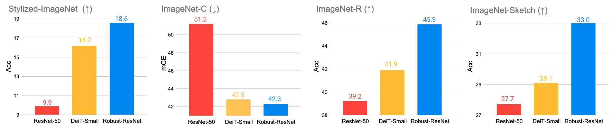

# Can CNNs Be More Robust Than Transformers?  
This is a PyTorch/PyTorch-XLA implementation of the ICLR'23 paper  [Can CNNs Be More Robust Than Transformers?](https://arxiv.org/abs/2206.03452).
It can run on both GPU or TPU devices (see [TRAIN](https://github.com/UCSC-VLAA/RobustCNN/blob/main/TRAIN.md)/[TEST](https://github.com/UCSC-VLAA/RobustCNN/blob/main/TEST.md) instructions).
Our implementation is heavily based on the bits_and_tpu branch of [TIMM](https://github.com/rwightman/pytorch-image-models/tree/bits_and_tpu).

<div align="center">
  
</div>


## Introduction
The recent success of Vision Transformers is shaking the long dominance of Convolutional Neural Networks (CNNs) in 
image recognition for a decade. Specifically, in terms of robustness on out-of-distribution samples, 
recent research finds that Transformers are inherently more robust than CNNs, regardless of different training setups. 
Moreover, it is believed that such superiority of Transformers should largely be credited to 
their self-attention-like architectures per se. 
In this work, we question that belief by closely examining the design of Transformers. 
Our findings lead to three highly effective architecture designs for boosting robustness, 
yet simple enough to be implemented in several lines of code, 
namely a) patchifying input images, b) enlarging kernel size, and c) reducing activation layers and normalization layers. 
Bringing these components together, we are able to build pure CNN architectures without any attention-like operations 
that is as robust as, or even more robust than, Transformers. 
We hope this work can help the community better understand the design of robust neural architectures.


## Installation

This repo is a modification on the bits_and_tpu branch of [TIMM](https://github.com/rwightman/pytorch-image-models/tree/bits_and_tpu) repo. 
Installation and preparation follow that repo.

Note that this repo is compatible with both GPU and TPU. If you want to run the code on Google Cloud TPU, here are some documents you may find helpful:
[Google Cloud User's Guide](https://cloud.google.com/tpu/docs/pytorch-xla-ug-tpu-vm) and [TIMM bits README](https://github.com/rwightman/pytorch-image-models/blob/bits_and_tpu/timm/bits/README.md)

## Data preparation

### Clean Dataset

Download and extract ImageNet train and val images from http://image-net.org/.
The directory structure is the [standard layout](https://pytorch.org/docs/stable/torchvision/datasets.html#imagefolder) for the torchvision, and the training and validation data is expected to be in the `train` folder and `val` folder respectively:

```
/path/to/imagenet/
  train/
    class1/
      img1.jpeg
    class2/
      img2.jpeg
  val/
    class1/
      img3.jpeg
    class/2
      img4.jpeg
```

### Out-of-distribution Dataset

Download and extract [Stylized-ImageNet](https://github.com/rgeirhos/Stylized-ImageNet), [ImageNet-C](https://github.com/hendrycks/robustness), 
[ImageNet-R](https://github.com/hendrycks/imagenet-r), [ImageNet-Sketch](https://github.com/HaohanWang/ImageNet-Sketch) val images:

```
/path/to/datasets/
    class1/
      img1.jpeg
    class/2
      img2.jpeg
```

## Usage

### Training Instructions
The training instructions are in [TRAIN.md](TRAIN.md).

### Testing Instructions
The testing instructions are in [TEST.md](TEST.md).

## Pretrained models

Here are ImageNet-1k trained weights for four model instantiations. All models are trained for 300 epochs with DeiT recipe. 
Please follow the testing script to evaluate them on out-of-distribution dataset.

|                                       |                                          Pretrained Model                                           | ImageNet&#8593; | Stylized-ImageNet&#8593;  | ImageNet-C&#8595;  | ImageNet-R&#8593;  | ImageNet-Sketch&#8593;  |
| ------------------------------------- | :-------------------------------------------------------------------------------------------------: | :--------------:| :-----------------------: | :----------------: | :----------------: |:----------------------: |
| DeiT-S  (Official Checkpoint)         | [download link](https://github.com/facebookresearch/deit)                                           |       79.8      |           16.2            |        42.8        |        41.9        |          29.1           |
| Robust-ResNet-DW-Small                | [download link](https://drive.google.com/file/d/1cbS3NGkkzKw2Uhq8ATMbsoGjIx8zhwgv/view?usp=sharing) |       79.4      |           18.6            |        42.3        |        45.9        |          33.0           |
| Robust-ResNet-Inverted-DW-Small       | [download link](https://drive.google.com/file/d/1g551TsZmVrSZ4BXje9RcT7gG_UjjFQmO/view?usp=sharing) |       79.0      |           19.5            |        42.1        |        45.9        |          32.8           |
| Robust-ResNet-Up-Inverted-DW-Small    | [download link](https://drive.google.com/file/d/1lQ0zPqO6nmtXWt5r9d-M4k_GHVeW41Qy/view?usp=sharing) |       79.2      |           20.2            |        40.9        |        48.7        |          35.2           |
| Robust-ResNet-Down-Inverted-DW-Small  | [download link](https://drive.google.com/file/d/1gZVclPJXT50F6iAJHUv8Z6wG6C0ZhXds/view?usp=sharing) |       79.9      |           19.3            |        41.6        |        46.0        |          32.8           |


## Acknowledgment

This repo is built on [timm](https://github.com/rwightman/pytorch-image-models). 
And this work is supported by a gift from Open Philanthropy, TPU Research Cloud (TRC) program, and Google Cloud Research Credits program.


## Citation

```
@inproceedings{wang2022robustcnn,
  title     = {Can CNNs Be More Robust Than Transformers?}, 
  author    = {Wang, Zeyu and Bai, Yutong and Zhou, Yuyin and Xie, Cihang},
  booktitle = {International Conference on Learning Representations},
  year      = {2023},
}
```
